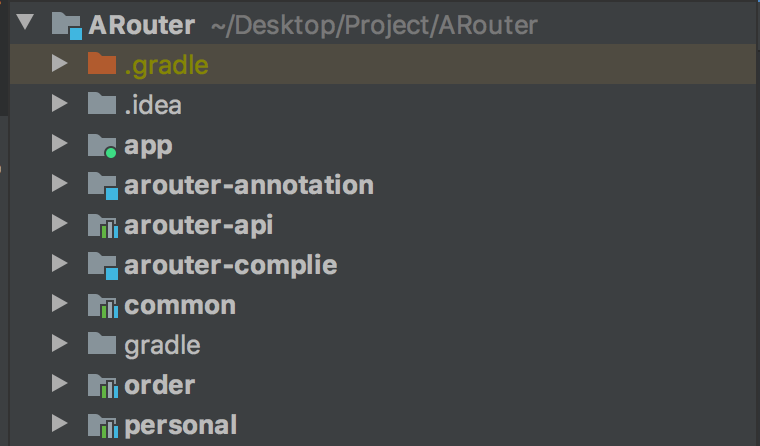
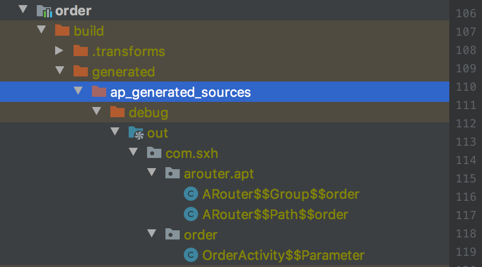
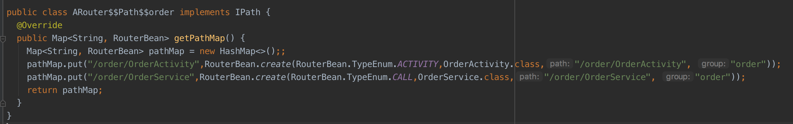
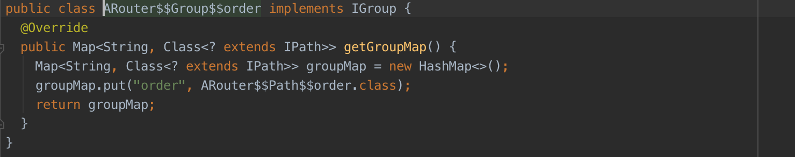
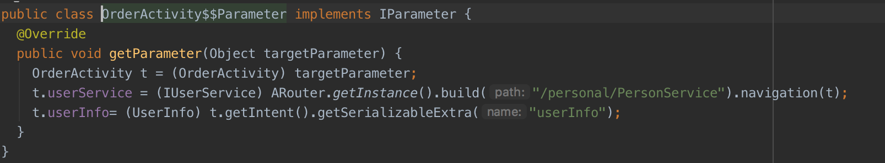

# ARouter
随着产品需求的不断迭代，项目总是越来越大，这是无法避免的，因此组件化方案现在也基本上普遍开来。在组件化方案中，互不依赖的模块之间的通信可以说是组件化中最重要的一个环节，这一块的代表就是阿里巴巴开源的组件化通信框架ARouter。在工作之余，学习了一波ARouter的原理，搞清楚它的强大之处，顺便自己动手撸了一波码，手写简易版ARouter框架，命名就叫ARouter，哈哈哈。

## 项目介绍
简易版ARouter的实现，功能包括
- 页面路由
目前只支持Activity跳转
- 参数传递
跳转页面时携带参数，支持String、int、Serializable等，可自行扩展
- 接口服务路由
互不依赖的module之间的业务接口路由，比如order与personal模块互不依赖，但personal可以调用order提供的业务接口实现


## 项目结构

- app module
工程的主module，算是一个壳
- order module
模拟一个业务子module，订单中心
- personal module
模拟一个业务子module，个人中心
- common module
这是基础module，提供一些基础能力，类似utils等，所以module都需要依赖它
- arouter-annotation module
注解包，存放自定义注解，包括@Router、@Parameter
- arouter-complie module
注解处理器，即apt工作的地方,包括ARouterProcessor、ParameterProcessor
- arouter-api
手写ARouter框架的核心api包，包括一些约定接口的定义以及暴露给使用者的API

## 使用
模仿ARouter框架，使用着只需要关注两个注解以及一个入口类即可，纵享丝滑。
- @Router注解
```java
//定义
@Target(ElementType.TYPE)
@Retention(RetentionPolicy.CLASS)
public @interface Router {

    String path();

    String group() default "";

}

//使用
@Router(path = ARouterPath.App.MAIN_ACTIVITY_PATH, group = ARouterPath.App.GROUP)
public class MainActivity extends AppCompatActivity {
  
}
```

- @Parameter注解
```java
//定义
@Retention(RetentionPolicy.CLASS)
@Target(ElementType.FIELD)
public @interface Parameter {

    String name() default "";
}

//使用
public class OrderActivity extends Activity {

    @Parameter(name = ARouterPath.Personal.PERSONAL_SERVICE_PATH)
    IUserService userService;

    @Parameter(name = "userInfo")
    UserInfo userInfo;  
}
```
- ARouter类
暴露给使用者的API调用类
```java
/**
 * ARoute注解使用管理器
 */
public class ARouter {

    private static ARouter instance;

    public static ARouter getInstance() {
        if (instance == null) {
            synchronized (ARouter.class) {
                if (instance == null) {
                    instance = new ARouter();
                }
            }
        }
        return instance;
    }

    private ARouter() {
        groupLruCache = new LruCache<>(100);
        pathLruCache = new LruCache<>(100);

        parameterManager = new ParameterManager();
    }
    
    /**
     * 构建路由
     *
     * @param path
     * @return
     */
    public BundleManager build(String path) {
        ...
    }

    /**
     * 触发路由
     *
     * @param context
     * @param bundleManager
     * @return
     */
    @RequiresApi(api = Build.VERSION_CODES.JELLY_BEAN)
    public Object navigation(Context context, BundleManager bundleManager) {
        ...
    }

    /**
     * 注入参数
     *
     * @param activity 页面activity
     */
    public void inject(Activity activity) {
        ...
    }
}
```
## 原理
虽然只是简易版的ARouter，但与ARouter的核心原理一模一样。编译器通过apt技术分析注解，使用javapoet框架生成相应的辅助代码，业务模块api调用再通过类加载机制进行加载处理，这中间加了一层Lru缓存，算是一个小小的优化吧。难点其实就是辅助代码的生成。部分APT生成代码示例：









温馨提示：生成代码时，一定要细心细心再细心，不然各种编译出错，还不怎么方便直接定位错误代码，真的头皮发麻。

## 写在最后
看着功能简单，但也让我足足编码了一个礼拜，还好最后实现了想要的效果，算功夫不负有心人了吧，代码里注释都已补全，特别详细，欢迎大家一起学习交流。


